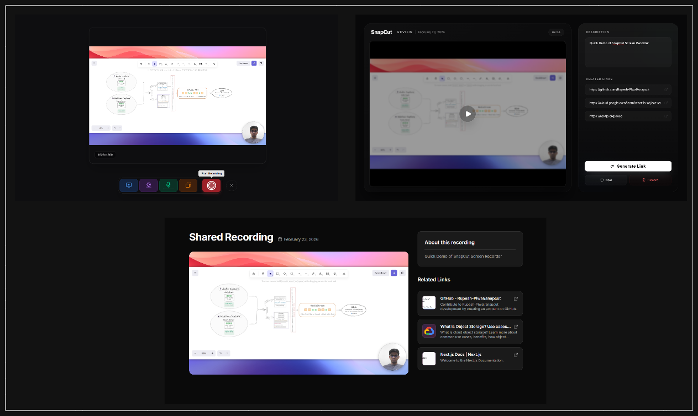
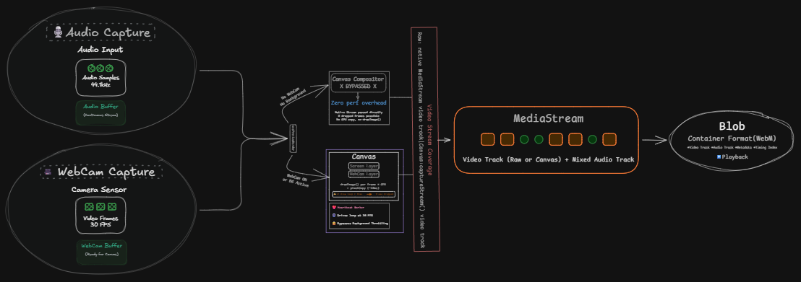

# 🎥 SnapCut – Record & Share Instantly.

[](https://github.com/Rupesh-Piwal/snapcut)   [](https://x.com/intent/follow?screen_name=rpmarch21)

<p align="start">
    Browser-based screen recorder with instant shareable links.
    <br />
    Record → Review → Share — no downloads, no accounts, no friction.
  </p>

[]()

---

## What Is This?

Snap-Cut is a lightweight **Loom alternative** that runs entirely in the browser. Users can record their screen with a webcam overlay, customize the look, and instantly generate a shareable video link — no desktop app required.

**Built for**: async standups, bug reports, design reviews, product walkthroughs.

## 🚀 Live Demo

#### LIVE DEMO 👉🏻 [Click to visit Snapcut](https://snapcutt.vercel.app/)

#### GITHUB REPO 👉🏻 [Click to visit Codebase](https://github.com/Rupesh-Piwal/snapcut)

#### PORTFOLIO 👉🏻 [View My Portfolio](https://rpiwal.vercel.app)

## 📸 ScreenShots



## Key Features

| Feature                          | Details                                                                      |
| -------------------------------- | ---------------------------------------------------------------------------- |
| 🎥 **Screen + Webcam Recording** | Real-time Canvas compositing at 30fps with draggable PiP webcam overlay      |
| 🎨 **Custom Backgrounds**        | 9 image backgrounds + 10 gradients, rendered on-canvas behind screen capture |
| 🔄 **Webcam Customization**      | Circle / Square / Rounded shapes, 3 sizes (S/M/L), drag to reposition        |
| 🎙️ **Audio Mixing**              | Mic + system audio mixed via Web Audio API with adjustable gain              |
| 📊 **Live Mic Level**            | Zero-rerender audio visualization using refs + direct DOM updates            |
| ⏱️ **Recording Controls**        | Countdown timer, recording duration, auto-stop at 120s                       |
| ☁️ **Direct S3 Upload**          | Client-side upload via presigned URLs with real-time progress                |
| 🔗 **Instant Share Links**       | `/v/{id}` pages with video player, description, and link previews            |
| 🖥️ **Video Player**              | Custom player with play/pause, seek, mute toggle, and progress bar           |

## Architecture


## Technical Highlights

### Web Worker Heartbeat

Browser `setInterval` is throttled to 1fps in background tabs. During recording, if the user switches tabs, this would produce frozen frames. A **Web Worker timer** maintains a steady 30fps tick regardless of tab visibility — ensuring consistent recording quality.

### Finite State Machine

Recording lifecycle is governed by a strict FSM: `idle → initializing → recording → stopping → completed`. Any state can transition to `error`. This prevents impossible states like double-starting or stopping an already-stopped recording.

### Zero-Rerender Audio Visualization

The mic level indicator bypasses React's render cycle entirely. Audio analysis (RMS calculation + exponential smoothing) feeds directly into DOM transforms via refs — achieving smooth 60fps animation with zero component re-renders.

### Canvas Composition Engine

Screen capture and webcam are composited on a 1920×1080 Canvas with:

- Aspect-ratio-aware contain/cover rendering
- Clipped shapes (circle, square, rounded rect) for webcam
- Shadow effects for depth
- Background image/gradient rendering
- Pointer event → canvas coordinate mapping for drag-to-reposition

### Security

- SSRF protection on link preview fetching (blocks localhost, private IPs)
- Content-type whitelist (`video/webm` only) with 500MB size cap
- S3 presigned URLs with 10-minute expiry
- HeadObject verification before persisting metadata

## Tech Stack

| Layer            | Technology                                                     |
| ---------------- | -------------------------------------------------------------- |
| **Framework**    | Next.js 16 (App Router)                                        |
| **UI**           | React 19, Tailwind CSS 4, Radix UI, Framer Motion              |
| **Language**     | TypeScript 5                                                   |
| **Database**     | Neon Postgres (serverless) via Drizzle ORM                     |
| **Storage**      | AWS S3 (presigned URLs)                                        |
| **Auth**         | better-auth (Google OAuth)                                     |
| **Icons**        | Phosphor Icons, Lucide React                                   |
| **Browser APIs** | Canvas, MediaRecorder, Web Workers, Web Audio, getDisplayMedia |

## Getting Started

### Prerequisites

- Node.js 18+
- AWS S3 bucket
- Neon Postgres database

### Setup

```bash
# Clone
git clone https://github.com/Rupesh-Piwal/Snap-cut.git
cd snap-cut

# Install
npm install

# Configure environment
cp .env.example .env
# Fill in your credentials (see below)

# Run database migrations
npx drizzle-kit push

# Start dev server
npm run dev
```

### Environment Variables

```env
# Database (Neon)
DATABASE_URL=postgresql://...

# Auth
BETTER_AUTH_URL=http://localhost:3000
GOOGLE_CLIENT_ID=
GOOGLE_CLIENT_SECRET=

# AWS S3
S3_BUCKET=your-bucket-name
S3_REGION=ap-south-1
S3_ACCESS_KEY_ID=
S3_SECRET_ACCESS_KEY=
```

## Project Structure

```
snap-cut/
├── app/
│   ├── api/                    # API routes (presign, videos)
│   ├── components/recording/   # Recording UI (6 components)
│   ├── db/                     # Drizzle schema + connection
│   ├── record/                 # /record page
│   └── v/[videoId]/            # Shareable video page (SSR)
├── lib/
│   ├── hooks/                  # Core logic (5 custom hooks)
│   ├── layouts/                # Canvas layout engine
│   ├── recording-state-machine.ts
│   ├── backgrounds.ts
│   ├── upload-utils.ts
│   └── s3-server.ts
├── components/
│   ├── landing/                # Landing page (6 components)
│   ├── ui/                     # Shadcn primitives
│   └── video-player.tsx
├── workers/
│   ├── heartbeat.worker.js     # 30fps tick timer
│   └── canvasRenderer.worker.ts
└── drizzle/                    # DB migrations
```

## How It Works

```
1. User enables camera + mic → getUserMedia()
2. User shares screen → getDisplayMedia()
3. Streams feed into Canvas compositor (30fps via Worker heartbeat)
4. User clicks Record → 3s countdown → MediaRecorder.start(1000)
5. Audio mixed via Web Audio API (mic + system audio)
6. Chunks collected every 1s for resilience
7. User stops → Blob created → Review screen
8. Upload: presigned S3 URL → XHR PUT with progress → metadata saved to Postgres
9. Share link generated: /v/{uuid}
```

---

<p align="center">
  Built by <a href="https://github.com/Rupesh-Piwal">Rupesh Piwal</a>
</p>
